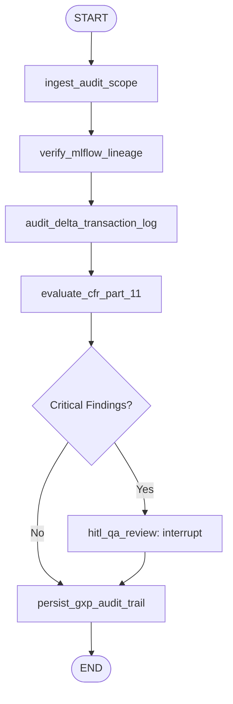

# GxP Compliance & State Graph Auditor

Guide for executing regulatory audits, verifying cryptographic data lineage, inspecting Delta Lake transaction logs, and performing Human-in-the-Loop (HITL) electronic sign-offs compliant with FDA 21 CFR Part 11.

## 1. Architecture & State Graph Flow

The auditor is implemented in `agentic-ai/graph_auditor.py` as a LangGraph `StateGraph` with persistent checkpointers (`MemorySaver` or external checkpoint backends).



### Core Components
- **`GxPGraphAuditor`**: Graph controller managing compilation, execution, interrupt handling, and resumption.
- **`AuditState`**: TypedDict carrying target paths, MLflow run metadata, audit findings list, sign-off objects, and compliance booleans.
- **`AuditFinding`**: Structured finding recording `code`, `category`, `severity` (`CRITICAL_FATAL`, `ERROR`, `WARNING`, `INFO`), `passed`, and diagnostic `details`.
- **`QASignoff`**: 21 CFR §11.50 signature record capturing `operator_id`, `signature_timestamp`, `meaning`, `comments`, and SHA-256 `signature_hash`.

## 2. Regulatory Evaluation Checks

| Category | Evaluation Target | Compliance Standard |
| :--- | :--- | :--- |
| `MLFLOW_LINEAGE` | Verifies SHA-256 provenance hashes for code, configuration, and data inputs logged during pipeline execution. | 21 CFR §11.10(e) (Audit trails) |
| `DELTA_TRANSACTION_LOG` | Inspects `_delta_log/*.json` commits to ensure Change Data Feed (`delta.enableChangeDataFeed`) is enabled and commit protocols are intact. | 21 CFR §11.10(b) (Inspection & copy) |
| `CFR_PART_11` | Verifies deterministic 64-bit key derivations (`xxhash64`), concept mapping resolution (concept ID `0` for unmapped codes), and immutable storage contracts. | 21 CFR §11.10(a) (Validation) |
| `SCHEMA_INTEGRITY` | Evaluates Great Expectations data contract results from `governance/rules.json`. | GxP Data Integrity |

## 3. Human-in-the-Loop (HITL) Review & Electronic Signatures

When critical findings or regulatory deviations are detected, the graph raises an `interrupt()`:
1. Execution halts and persists state to the checkpointer.
2. An authorized QA auditor inspects the findings.
3. The auditor provides an electronic signature payload:
   ```python
   qa_payload = {
       "operator_id": "qa_officer_01",
       "meaning": "Reviewed and approved with documented deviation justification.",
       "comments": "Quarantine rate within acceptable clinical trial tolerance.",
       "action": "APPROVE",  # or "REJECT"
   }
   ```
4. The graph resumes via `Command(resume=qa_payload)` and records a cryptographic digest of the signature in the audit trail.

## 4. Execution & Usage

### Programmatic Usage
```python
from agentic_ai.graph_auditor import GxPGraphAuditor

auditor = GxPGraphAuditor()
result = auditor.run_audit(
    mlflow_run_id="<RUN_ID>",
    delta_table_paths=["/path/to/gold/person", "/path/to/gold/measurement"],
)

if result.get("hitl_required"):
    print("Audit paused for HITL QA sign-off.")
    # Resume with QA credentials
    final_state = auditor.resume_audit(thread_id=result["thread_id"], signoff_data=qa_payload)
```

### CLI Execution
```powershell
.\.venv\Scripts\python.exe agentic-ai/graph_auditor.py `
  --mlflow_run_id "d9b23e7f4c1a..." `
  --delta_paths "mock_data/gold/person" "mock_data/gold/condition_occurrence" `
  --operator_id "qa_lead_vivi"
```

## 5. Verification
Execute the auditor test suite to verify graph compilation, interrupt handling, and signature hashing:
```powershell
.\.venv\Scripts\pytest.exe tests/unit/test_graph_auditor.py -v --tb=short
```
