# 🔬 Life Sciences Data Foundry — Clinical & Multi-Omics Showcase Notebooks

This directory contains standalone, interactive demonstration notebooks illustrating the end-to-end Medallion data engineering lifecycle, biostatistical analysis, and regulatory GxP governance implemented by the Life Sciences Data Foundry (LSDF).

---

## 🏛️ Pipeline Progression

```mermaid
flowchart LR
    A["Bronze Raw Ingestion<br/>(EHR & VCF Genomics)"] --> B["Silver GxP Filtration<br/>& Quarantine Sinks"]
    B --> C["Gold OMOP CDM v5.4<br/>(PERSON, CONDITION, MEASUREMENT)"]
    C --> D["Cohort Phenotyping<br/>& HIPAA De-Identification"]
    D --> E["Time-to-Event (TTE) Mart<br/>& Kaplan-Meier Estimation"]
    E --> F["Publication-Grade<br/>Survival Curve Visualizations"]
    F --> G["Target Discovery Mart<br/>& Delta Lake Persistence"]
    G --> H["LangGraph GxP Audit<br/>& DMTA Target Triage (e-Sig)"]
```



---

## 📁 Showcase Files

1. **`clinical_multiomics_showcase.py`**:
   - **Databricks Notebook & VS Code Interactive Format**: Formatted with `# Databricks notebook source`, `# COMMAND ----------`, and `# %%` cell markers for seamless execution in Databricks Workspaces and VS Code Interactive Windows.
   - **Headless CLI Execution**: Can be run directly from terminal without a GUI display server:
     ```powershell
     python notebooks/clinical_multiomics_showcase.py --headless --output-dir mock_data/showcase_output
     ```
2. **`clinical_multiomics_showcase.ipynb`**:
   - Standard Jupyter Notebook format containing full clinical context, LaTeX biostatistical formulas, and structured markdown cells for web-based or GitHub viewing.

---

## 🚀 Execution Instructions

### 1. Local Interactive Mode (VS Code / JupyterLab)
Open `notebooks/clinical_multiomics_showcase.ipynb` or `notebooks/clinical_multiomics_showcase.py` in VS Code or JupyterLab. Select the `.venv` Python kernel (`Python 3.11+`). Run cells sequentially.

### 2. Standalone CLI Headless Execution
Run the automated pipeline script from the repository root:
```powershell
.\.venv\Scripts\python.exe notebooks/clinical_multiomics_showcase.py --headless
```

Options:
- `--data_dir <path>`: Custom input directory containing patient demographics, clinical diagnoses, lab measurements, and VCF files (defaults to `analytical-layer/data/`).
- `--output_dir <path>`: Custom target warehouse directory for Delta tables, quarantine sinks, and figures.
- `--simulate_expanded_cohort`: Synthesizes longitudinal follow-up for a cohort of 40 patients with ClinVar pathogenic variants vs wild-type for high-density survival curves (defaults to `True`).

### 3. Databricks Asset Bundle (DABs) Deployment
Deploy and run as an automated task on a Databricks cluster:
```bash
databricks bundle deploy -t dev
databricks bundle run omop_cdm_medallion_pipeline -t dev
```

---

## 📊 Key Analytical Deliverables

- **Zero Data Loss Provability**: Real-world records violating physiological boundaries or timestamp formats are routed to dedicated Delta Lake dead-letter sinks (`quarantine_patients`, `quarantine_conditions`, `quarantine_measurements`) preserving raw payloads and failure reasons.
- **HIPAA Safe Harbor Compliance**: Applies keyed HMAC-SHA256 pseudonymization, salt-seeded date shifting (±Δ days preserving inter-event duration and survival follow-up), and age 89+ capping (45 CFR §164.514(b)(2)).
- **Kaplan-Meier Survival Estimation**: Evaluates non-parametric product-limit survival functions $S(t) = \prod [1 - d(t)/n(t)]$ with Greenwood standard errors across ClinVar pathogenic variant strata and exports high-resolution publication figures (`kaplan_meier_survival_curves.png`).
- **Target-to-Phenotype Discovery & Delta Persistence**: Evaluates Haldane-Anscombe disease odds ratios, tractability scores, and ClinVar mutation burden for therapeutic target validation, and persists the Target Evidence Mart to Delta Lake format with Liquid Clustering.
- **Autonomous GxP Audit & DMTA Target Triage**: LangGraph state machine evaluation of Delta Lake transaction log continuity, compliance status scoring, and autonomous DMTA target feasibility validation with cryptographically sealed FDA 21 CFR §11.50 Electronic Signatures.
